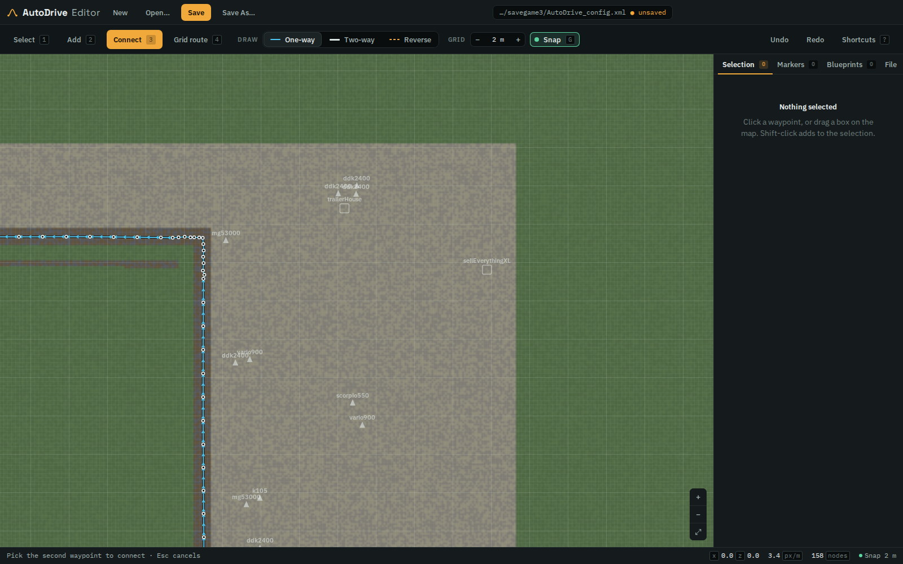

# AutoDrive Editor (FS25)

[](https://github.com/pgatzka/autodrive-editor/actions/workflows/ci.yml)
[](https://github.com/pgatzka/autodrive-editor/actions/workflows/release.yml)

A desktop editor for route networks of the [AutoDrive](https://github.com/Stephan-S/FS25_AutoDrive) mod for Farming Simulator 25. Import your savegame's `AutoDrive_config.xml`, edit the waypoint network visually, and export it back.



The interface follows a dedicated design system: a dark desktop shell where the
canvas is the only thing that grows, the active tool is the single accent-filled
control on screen, and the blueprint workspace announces itself through four
independent signals. See [docs/ui-revamp-brief.md](docs/ui-revamp-brief.md) for
the brief it was built from.

## Features

- **Import / export `AutoDrive_config.xml`** — exact FS25 format. Waypoint ids are compacted to `1..N` on save, and all other sections of an imported file (user settings, experimental features, …) are preserved untouched.
- **Grid snapping** — configurable grid granularity in meters, an X/Z offset that shifts the grid onto whatever the map already has, and a chunk width (how many cells apart the emphasised lines sit). All four are typed or stepped, and they are remembered per map: open a config and the grid you last used on that map comes back. Toggle snapping with `G`; it applies to placing, dragging, and blueprint stamping.
- **Grid route tool** — connect two nodes and a node is created at _every grid-line crossing_ along the route, spaced by your grid setting.
- **Full node/edge editing** — add, move, delete; one-way, two-way, and reverse connections; box select; undo/redo.
- **Blueprints** — save any selection (nodes + connections + markers) as a named blueprint, stamp it anywhere with live move/rotate preview. The library persists between sessions and blueprints can be exported/imported as JSON files to share.
- **Blueprint editor** — build or rework blueprints from scratch on their own canvas ("New blueprint" / "Edit" in the Blueprints tab): all normal tools work there (add, connect, grid route, flags, markers, undo), a crosshair marks the stamp anchor, and Save & close returns you to your map exactly as you left it.
- **Flags** — toggle subprio (pathfinding cost ×20) and traffic-system flags per selection; subprio nodes render yellow.
- **Markers & groups** — create, rename, and delete map markers and organize them into groups.
- **Copy / cut / paste** — `Ctrl+C`, `Ctrl+X`, `Ctrl+V` (or the buttons in the Selection tab) move a selection with its internal connections, flags and markers. A paste lands beside the original, scaled to the size of what was copied and rounded to whole grid cells so it keeps the original's alignment, and arrives selected so it can be dragged into place. Repeated pastes walk further out. The clipboard survives switching into the blueprint editor, so a piece of a map can be pasted there and saved as a blueprint.
- **Merge stacked nodes** — the File tab counts waypoints sitting on one spot (a blueprint stamped twice, two routes meeting at the same crossing, a node dragged onto another) and folds each stack into one node with a button. "One spot" is a distance you set — 10 cm by default, because nodes that are the same place on the map rarely have identical coordinates: two grid routes compute a shared crossing from different endpoints and land a fraction of a millimeter apart. Connections, flags and markers of the whole stack move to the survivor, and it is undoable.
- **Route tools** — insert midpoint on a connection, distribute a run of nodes evenly, generate a smooth curve between two nodes (tangents follow the adjoining roads).
- **Savegame map background** — opening an `AutoDrive_config.xml` inside a savegame folder automatically renders the map's terrain under the network: a hillshaded elevation view decoded from the save's 16-bit `terrain.heightmap.png`, the painted ground surfaces from `terrain.lod.type.cache`, plus placeable and vehicle icons from the save. New nodes get their height (`y`) sampled from the real terrain. Opacity and icons are adjustable in the File tab; a folder can also be picked manually.
- **Worked ground** — fields show up as soil against the meadow. Plowing does not repaint the terrain, so a field is invisible in the savegame's texture layer as a filled shape — only its edge is painted. The editor therefore shades the ground those painted edges enclose: anything you cannot walk to from the edge of the map without crossing painted ground is a field or a yard. The File tab reports the area found and can turn the shading off.

## Usage

```bash
npm install
npm run dev      # development: Vite + Electron with hot reload
npm run start    # build and run the app
npm run dist     # package installers (NSIS on Windows, AppImage on Linux, DMG on macOS)
```

Your routes live in `Documents/My Games/FarmingSimulator2025/savegame#/AutoDrive_config.xml`. Open it, edit, save — back up the original first, and don't save while the game has the savegame open.

### Controls

| Input                                | Action                                                                                             |
| ------------------------------------ | -------------------------------------------------------------------------------------------------- |
| `1`–`4`                              | Tools: Select, Add nodes, Connect, Grid route                                                      |
| Mouse wheel                          | Zoom to cursor                                                                                     |
| Middle/right drag                    | Pan                                                                                                |
| Left click / drag                    | Select, move selection, box select (`Shift` adds)                                                  |
| `Ctrl`+click (Add tool)              | Place node connected to the previous one                                                           |
| Click node A, then B (Connect tool)  | Connect with the active mode; clicking again cycles one-way → other way → two-way → reverse → none |
| `R` / `Shift`+`R`                    | Rotate blueprint ghost while placing                                                               |
| `G`                                  | Toggle grid snap                                                                                   |
| `Ctrl`+`Z` / `Ctrl`+`Y`              | Undo / redo                                                                                        |
| `Ctrl`+`S` / `Ctrl`+`Shift`+`S`      | Save / Save As                                                                                     |
| `Ctrl`+`C` / `Ctrl`+`X` / `Ctrl`+`V` | Copy / cut / paste the selection                                                                   |
| `Delete`                             | Delete selection                                                                                   |
| `Esc`                                | Cancel placement / pending connection / selection                                                  |

## How AutoDrive stores its network

Each waypoint has an id, `x/y/z` position, a `flags` bitmask (`1` = subprio, `2` = traffic system) and two adjacency lists: `out` (ids it drives to) and `incoming` (ids that drive into it). A connection A→B with `B.incoming` containing A is a normal one-way link; both directions present means two-way; A→B _without_ the incoming entry means the vehicle drives the segment in reverse. Map markers reference a waypoint id and carry a name and group.

In the XML, `id/x/y/z/flags` are comma-separated lists; `out`/`incoming` are semicolon-separated per waypoint with comma-separated ids inside and `-1` for none.

## Releases & updates

CI (`.github/workflows/ci.yml`) typechecks, builds, and runs the test suite on every push and pull request.

The release pipeline (`.github/workflows/release.yml`) is fully automated and only runs after the test suite passes:

- **Every push to `main`** builds installers for Windows, Linux, and macOS. They upload into a draft (nothing half-finished is ever visible), and once all assets are attached the pipeline publishes it as a **prerelease** tagged `v<next-patch>-dev.<run>` — the **unstable** channel. Older dev builds and their tags are pruned automatically, so there is always exactly one current dev build.
- **Pushing a tag `v*`** (e.g. `git tag v0.2.0 && git push origin v0.2.0`) builds the same installers into a **draft release** with that clean version. Publish that draft on GitHub to make it the new **stable** release, then bump the version in `package.json` on `main`.

In the app, the **File → Updates** section lets you pick the update channel — no credentials needed for either:

- **Stable** checks published, non-prerelease GitHub releases.
- **Unstable** checks the automatically published dev prereleases.

"Download & install" fetches the installer for your OS into your Downloads folder and, on Windows, starts it right away — the NSIS installer updates the app in place.

## Contributing

See [docs/DEVELOPMENT.md](docs/DEVELOPMENT.md) for the architecture, coding
standards (DRY / SOLID / KISS) and testing requirements, and
[CONTRIBUTING.md](CONTRIBUTING.md) for the short version. `npm run verify` runs
everything CI enforces: formatting, lint, typecheck, unit tests and the 80%
coverage thresholds.

## Development notes

- Renderer: React + TypeScript + canvas (Vite). Electron main/preload are plain CJS (`electron/`).
- The app also runs in a plain browser (`npx vite`) with file pickers/downloads instead of native dialogs — handy for development and testing.
- Domain logic lives in `src/model/` as pure modules with unit tests beside them (`npm test`); the React views and IO wrappers are covered by an end-to-end smoke test that drives the real app (`npm run test:ui`).
